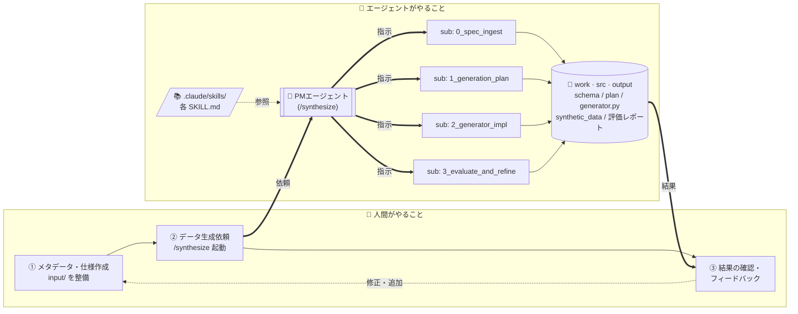

# mockdata-generator

仕様駆動の合成データ生成パイプライン。
テーブル定義書 / サンプルデータ / データ仕様メモ / 制約条件を入力として、再現可能な Python 生成器と評価レポートを出力する。

## アーキテクチャ

**人間がやること**（左）と **エージェントがやること**（右）を 2 つの枠で分けて整理する。
人間側はメタデータ整備 → 依頼 → 結果確認のループ。エージェント側では PM エージェントが SKILL.md 群を参照しつつ、4 体のサブエージェントを順次起動する。



人間側はメタデータと依頼を出すループに集中し、生成・評価の実作業はすべてエージェント側に閉じる。PM はコードを書かず、各ステップをサブエージェントに委譲し、Acceptance Criteria を満たしたかだけを確認する。

## 思想

- ユーザーの責務は **input/ の用意** と **PM エージェントへの指示** のみ。
- PM エージェント (`/synthesize`) はワークフローを知っているが、実作業はしない。各ステップを **サブエージェント** に委譲する。
- 各サブエージェントは `.claude/skills/<step>/SKILL.md` に書かれた **タスク非依存の SKILL** を参照して動く。
- 列名・テーブル名・制約・サンプルなど **タスク固有の情報** は `examples/<task_name>/input/` 配下にすべて閉じ込める。
- データ生成はタスク単位で独立。タスクごとに `input/`, `work/`, `src/`, `output/` を持つ。

## ディレクトリ構成

```
mockdata-generator/
├── docs/
│   └── spec.md                # SKILL定義（共通・タスク非依存）
├── pyproject.toml             # uv 環境
├── README.md                  # 本ドキュメント
└── examples/
    ├── customer/                       # タスク例1: 顧客マスタ単体
    │   ├── input/
    │   │   ├── table_definition.csv    # 列名・型・許容値などの仕様
    │   │   ├── sample_data.csv         # 統計量推定用サンプル
    │   │   ├── data_spec.md            # 業務ルールの自然言語仕様
    │   │   └── constraints.md          # 必須/推奨制約
    │   ├── work/                       # 中間成果物（0_spec_ingest / 1_generation_plan）
    │   │   ├── inferred_schema.json
    │   │   ├── constraint_plan.md
    │   │   └── generation_plan.md
    │   ├── src/                        # 2_generator_impl / 3_evaluate_and_refine
    │   │   ├── generator.py
    │   │   └── evaluate.py
    │   └── output/                     # 最終成果物
    │       ├── synthetic_data.csv
    │       ├── evaluation_report.md
    │       └── constraints_check.csv
    └── customer_transactions/          # タスク例2: 顧客×取引（FK・在籍期間・年合計整合）
        ├── input/  work/  src/  output/
```

## 使い方

### 1. 入力ファイルを整備する

`examples/<task_name>/input/` を作り、以下を配置する。

- `*table_definition.csv`（または `.xlsx`）
- `*sample_data.csv`（テーブルが複数なら複数ファイル可）
- `data_spec.md`
- `constraints.md`

### 2. PM エージェントに一発実行を依頼する

Claude Code で次のスラッシュコマンドを実行するだけ。

```
/synthesize examples/<task_name>
```

PM エージェントが起動し、`0_spec_ingest → 1_generation_plan → 2_generator_impl → 3_evaluate_and_refine` の各ステップを **サブエージェント** に順次委譲する。各サブエージェントは対応する SKILL.md を参照してタスクを進め、成果物をファイルに書き出す。PM は完了報告と Acceptance Criteria の充足を確認したうえで次ステップに進み、最終的に `work/`・`src/`・`output/` 配下の生成物と評価サマリをユーザーに返す。

### 3. （任意）ステップ毎に確認したい場合

各 SKILL を個別に呼ぶこともできる。

```
/0_spec_ingest         examples/<task_name>
/1_generation_plan     examples/<task_name>
/2_generator_impl      examples/<task_name>
/3_evaluate_and_refine examples/<task_name>
```

スラッシュコマンドのほか、Claude が自動マッチで起動することもある（各 SKILL.md の `description` を参照）。
各 SKILL の詳細・入力・出力・Acceptance Criteria は `docs/spec.md` および `.claude/skills/<skill_name>/SKILL.md` を参照。

## 生成済みコードの直接実行

`/synthesize` でいったん `generator.py` / `evaluate.py` が出来上がった後は、件数や seed を変えて Python 側だけで再実行できる。

```bash
# タスク1（顧客マスタ単体）
uv run python examples/customer/src/generator.py --rows 10000 --seed 42
uv run python examples/customer/src/evaluate.py

# タスク2（顧客 × 取引）
uv run python examples/customer_transactions/src/generator.py --customers 1000 --seed 42
uv run python examples/customer_transactions/src/evaluate.py
```

タスク2 は親子関係（FK）・在籍期間内の取引日・直近1年の取引合計と annual_spend の整合といった、複数テーブルにまたがる制約のサンプル。`importlib` でタスク1 の generator/evaluate を再利用している（共通ロジックをタスク横断で使う一例）。

## 依存

- Python 3.13+
- uv（パッケージ管理）
- pandas, numpy, openpyxl, tabulate

```bash
uv sync
```

## 設計上の注意

- 生成データは **仕様駆動の合成データ**であり、匿名加工情報ではない。
- 実データの統計再現性は保証しない。PoC、画面モック、分析仮説検討用途を想定。
- 生成は `numpy.random.default_rng(seed)` で固定し再現可能にする。
- post sampling での除外件数は必ずログ出力する（`docs/spec.md` 参照）。
- サンプルデータの行をそのまま含めない。
