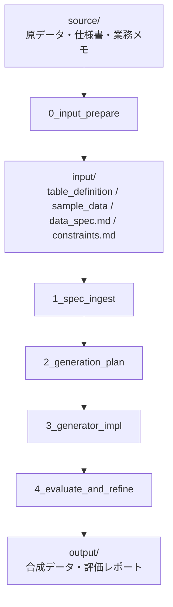

# mockdata-generator

仕様駆動で合成データを生成するためのエージェントワークフローです。
原データや業務ドキュメントから `input/` を構成し、再実行可能な Python 生成器と評価レポートを出力します。

## Quickstart

### 1. 依存関係を準備する

```bash
uv sync
```

必要環境:

- Python 3.14+
- uv

### 2. 原資料を配置する

タスクごとに `examples/<task_name>/source/` を作成し、`input/` の元になる原資料を配置します。

```text
examples/<task_name>/source/
├── raw_data/               # 原データ、既存CSV、ダンプなど
├── table_definitions/      # テーブル定義書、DDL、データ辞書など
├── docs/                   # 仕様書、業務説明資料、READMEなど
└── notes/                  # 制約メモ、補足、確認事項など
```

`source/` が原資料の正本です。`input/` は `0_input_prepare` が後続パイプライン向けに作成する整形済み入力として扱います。すでに `input/` が揃っている場合は、`source/` なしで `1_spec_ingest` から始めることもできます。



### 3. PM エージェントに生成を依頼する

Claude Code では次を実行します。

```text
/synthesize examples/<task_name>
```

Codex では、PM エージェントに同じタスクを依頼します。

```text
synthesize スキルを使って examples/<task_name> の合成データ生成を end-to-end で実行してください。
```

例:

```text
/synthesize examples/customer
/synthesize examples/customer_transactions
```

`examples/customer`(単一テーブル)と `examples/customer_transactions`(複数テーブル)は、`input/` から `work/`・`src/`・`output/` までを生成済みのサンプルです。`examples/university_enrollment` は `input/` のみ用意済みの未実行サンプル(`work/`・`src/`・`output/` は未生成)で、実際に実行して end-to-end の動作を試すための題材として用意しています。

```text
/synthesize examples/university_enrollment
synthesize スキルを使って examples/university_enrollment の合成データ生成を end-to-end で実行してください。
```

生成後は、主に以下のファイルを確認します。

```text
examples/<task_name>/
├── work/
│   ├── inferred_schema.json
│   ├── constraint_plan.md
│   └── generation_plan.md
├── src/
│   ├── generator.py
│   └── evaluate.py
└── output/
    ├── synthetic_data.csv        # 単一テーブルの場合
    ├── evaluation_report.md
    ├── constraints_check.csv
    └── quality_gate.json
```

合成データの CSV は、単一テーブルなら `output/synthetic_data.csv` の 1 ファイルですが、複数テーブルの場合はテーブル名ごとに分割されます(例: `output/customers.csv`, `output/transactions.csv`)。

`/synthesize` は最後の品質チェック結果を確認し、必須制約違反や明示仕様との不整合があれば、生成器を修正して再生成・再評価する改善ループを回します。PM エージェントは `quality_gate.json` の `requires_refinement` を機械可読な判定として利用し、残る課題は `evaluation_report.md` に明記されます。

## 生成済みコードの再実行

`/synthesize` で `generator.py` / `evaluate.py` が作成された後は、Python 側だけで再実行できます。

```bash
# 顧客マスタ単体
uv run python examples/customer/src/generator.py --rows 10000 --seed 42
uv run python examples/customer/src/evaluate.py

# 顧客 x 取引
uv run python examples/customer_transactions/src/generator.py --customers 1000 --seed 42
uv run python examples/customer_transactions/src/evaluate.py
```

## ステップごとに実行する場合

一括実行ではなく、各ステップを個別に確認しながら進めることもできます。

```text
/0_input_prepare       examples/<task_name>
/1_spec_ingest         examples/<task_name>
/2_generation_plan     examples/<task_name>
/3_generator_impl      examples/<task_name>
/4_evaluate_and_refine examples/<task_name>
```

## 詳細ドキュメント

- [docs/usage.md](docs/usage.md): 詳細な使い方、入力ファイル、実行手順、出力確認
- [docs/spec.md](docs/spec.md): ワークフロー仕様、設計方針、Acceptance Criteria
- [.agents/skills/synthesize/SKILL.md](.agents/skills/synthesize/SKILL.md): 一括実行の PM エージェント
- [.agents/skills/0_input_prepare/SKILL.md](.agents/skills/0_input_prepare/SKILL.md): input/ 作成
- [.agents/skills/1_spec_ingest/SKILL.md](.agents/skills/1_spec_ingest/SKILL.md): 仕様読み取り
- [.agents/skills/2_generation_plan/SKILL.md](.agents/skills/2_generation_plan/SKILL.md): 生成方針設計
- [.agents/skills/3_generator_impl/SKILL.md](.agents/skills/3_generator_impl/SKILL.md): 生成器実装
- [.agents/skills/4_evaluate_and_refine/SKILL.md](.agents/skills/4_evaluate_and_refine/SKILL.md): 評価と改善

## 注意

- 生成データは仕様駆動の合成データであり、匿名加工情報ではありません。
- 実データの統計再現性は保証しません。
- PoC、画面モック、分析仮説検討用途を想定しています。
