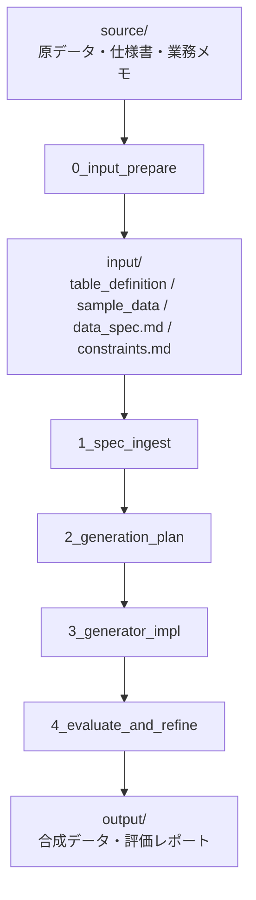

# Usage Guide

`mockdata-generator` の使い方をまとめたドキュメントです。
全体の仕様や設計方針は [spec.md](spec.md) を参照してください。

## 基本の流れ

```text
1. examples/<task_name>/source/ に原資料を配置する
2. /synthesize examples/<task_name> を実行する
3. input/、work/、src/、output/ の成果物を確認する
4. 必要に応じて source/ または input/ を直し、再実行する
```



## タスクディレクトリを作る

タスクごとに `examples/<task_name>/` を作成します。

```text
examples/<task_name>/
├── source/
└── input/
```

既存サンプルをコピーして始めることもできます。

```bash
cp -r examples/customer examples/my_task
```

## 原資料を配置する

標準では `source/` に、`input/` の元になる原資料を置きます。

```text
examples/<task_name>/source/
├── raw_data/
├── table_definitions/
├── docs/
└── notes/
```

各ディレクトリの役割は以下です。

| ディレクトリ | 役割 |
| --- | --- |
| `raw_data/` | 原データ、既存CSV、TSV、Excel、ダンプなど |
| `table_definitions/` | テーブル定義書、DDL、ER図、データ辞書など |
| `docs/` | 仕様書、業務説明資料、README、API仕様など |
| `notes/` | 制約メモ、補足、確認事項、手作業メモなど |

`source/` が原資料の正本です。原資料そのものを `input/` に混ぜず、`0_input_prepare` で後続ステップ向けに整理します。

## input/ を確認する

`input/` には、後続パイプラインが読む整形済み入力を置きます。`0_input_prepare` が作成しますが、すでに仕様が整理済みの場合は手で用意しても構いません。

```text
examples/<task_name>/input/
├── *table_definition.csv
├── *sample_data.csv
├── data_spec.md
└── constraints.md
```

各ファイルの役割は以下です。

| ファイル | 役割 |
| --- | --- |
| `*table_definition.csv` | 列名、型、必須/任意、桁数、コード値などのテーブル定義 |
| `*sample_data.csv` | 値域、分布、欠損率、カテゴリ比率などを推定するためのサンプル |
| `data_spec.md` | 業務ルール、列同士の関係、生成時に守りたい前提 |
| `constraints.md` | 必須制約、推奨制約、評価観点 |

複数テーブルを扱う場合は、テーブルごとに `*table_definition.csv` と `*sample_data.csv` を配置します。

```text
examples/customer_transactions/input/
├── customer_table_definition.csv
├── customer_sample_data.csv
├── transaction_table_definition.csv
├── transaction_sample_data.csv
├── data_spec.md
└── constraints.md
```

## 一括実行する

Claude Code では以下を実行します。

```text
/synthesize examples/<task_name>
```

Codex では、PM エージェントに同じタスクを依頼します。

```text
synthesize スキルを使って examples/<task_name> の合成データ生成を end-to-end で実行してください。
```

例:

```text
/synthesize examples/customer
/synthesize examples/customer_transactions
```

`examples/customer`(単一テーブル)と `examples/customer_transactions`(複数テーブル)は、`work/`・`src/`・`output/` まで生成済みのサンプルです。`examples/university_enrollment` は `input/` のみ用意済みの未実行サンプル(`work/`・`src/`・`output/` は未生成)で、実行例を一から試すための題材として利用できます。

```text
/synthesize examples/university_enrollment
synthesize スキルを使って examples/university_enrollment の合成データ生成を end-to-end で実行してください。
```

`/synthesize` は PM エージェントとして動作し、以下のステップを順番に実行します。

```text
0_input_prepare
  ↓
1_spec_ingest
  ↓
2_generation_plan
  ↓
3_generator_impl
  ↓
4_evaluate_and_refine
```

`input/` が未整備の場合は `0_input_prepare` で原資料から作成します。すでに `input/` が揃っている場合は、PM エージェントは `1_spec_ingest` から進めます。

最後の `4_evaluate_and_refine` で品質課題が見つかった場合、PM エージェントは `quality_gate.json`、評価レポート、制約チェック結果をもとに `3_generator_impl` へ戻り、生成器を修正してから再生成・再評価します。改善ループ後も残る課題は、追加仕様が必要な点または既知の限界として `evaluation_report.md` に記録します。

## 出力を確認する

実行後、タスクディレクトリには以下の成果物が作成されます。

```text
examples/<task_name>/
├── work/
│   ├── inferred_schema.json
│   ├── constraint_plan.md
│   └── generation_plan.md
├── src/
│   ├── generator.py
│   └── evaluate.py
└── output/
    ├── synthetic_data.csv        # 単一テーブルの場合
    ├── evaluation_report.md
    ├── constraints_check.csv
    └── quality_gate.json
```

合成データの CSV は、単一テーブルなら `output/synthetic_data.csv` の 1 ファイルです。複数テーブルの場合はテーブル名ごとに分割され、例えば `examples/customer_transactions` では `output/customers.csv` と `output/transactions.csv` が出力されます。

主に確認するファイルは以下です。

| ファイル | 確認内容 |
| --- | --- |
| `output/synthetic_data.csv`(複数テーブルは `output/<table>.csv`) | 生成された合成データ |
| `output/evaluation_report.md` | 評価結果のサマリ |
| `output/constraints_check.csv` | 制約ごとの判定結果 |
| `output/quality_gate.json` | PM エージェント向けの pass/fail と改善要否 |
| `src/generator.py` | 再実行可能な生成器 |
| `src/evaluate.py` | 評価スクリプト |

## 生成済みコードを再実行する

`generator.py` と `evaluate.py` が作成された後は、Claude Code を使わずに Python 側だけで再実行できます。

```bash
uv run python examples/customer/src/generator.py --rows 10000 --seed 42
uv run python examples/customer/src/evaluate.py
```

複数テーブルの例:

```bash
uv run python examples/customer_transactions/src/generator.py --customers 1000 --seed 42
uv run python examples/customer_transactions/src/evaluate.py
```

## ステップごとに実行する

一括実行ではなく、途中成果物を確認しながら進めたい場合は、各ステップを個別に実行できます。

```text
/0_input_prepare       examples/<task_name>
/1_spec_ingest         examples/<task_name>
/2_generation_plan     examples/<task_name>
/3_generator_impl      examples/<task_name>
/4_evaluate_and_refine examples/<task_name>
```

ステップごとの主な役割は以下です。

| ステップ | 役割 | 主な出力 |
| --- | --- | --- |
| `0_input_prepare` | 原資料から input/ 配下の標準ファイルを作る | `input/*table_definition*`, `input/*sample_data*`, `input/data_spec.md`, `input/constraints.md` |
| `1_spec_ingest` | 入力仕様を読み取り、機械可読なスキーマと制約計画を作る | `work/inferred_schema.json`, `work/constraint_plan.md` |
| `2_generation_plan` | 各列の生成方式を設計する | `work/generation_plan.md` |
| `3_generator_impl` | 生成器を実装し、合成データを出力する | `src/generator.py`, `output/*.csv` |
| `4_evaluate_and_refine` | 制約・仕様・サンプルに照らして評価し、品質課題があれば生成器を修正して再評価する | `src/evaluate.py`, `output/evaluation_report.md`, `output/constraints_check.csv`, `output/quality_gate.json` |

## 入力を修正して再実行する

生成結果が期待と違う場合は、まず `input/` の仕様を更新します。

- 列の意味や生成ルールを足す場合: `data_spec.md`
- 必ず守る条件を追加する場合: `constraints.md`
- 型、桁数、コード値を直す場合: `*table_definition.csv`
- 分布や値域の参考を変える場合: `*sample_data.csv`

修正後、同じコマンドを再実行します。

```text
/synthesize examples/<task_name>
```

## 関連ドキュメント

- [spec.md](spec.md): ワークフロー仕様、設計方針、Acceptance Criteria
- [../.agents/skills/synthesize/SKILL.md](../.agents/skills/synthesize/SKILL.md): 一括実行の PM エージェント
- [../.agents/skills/0_input_prepare/SKILL.md](../.agents/skills/0_input_prepare/SKILL.md): input/ 作成
- [../.agents/skills/1_spec_ingest/SKILL.md](../.agents/skills/1_spec_ingest/SKILL.md): 仕様読み取り
- [../.agents/skills/2_generation_plan/SKILL.md](../.agents/skills/2_generation_plan/SKILL.md): 生成方針設計
- [../.agents/skills/3_generator_impl/SKILL.md](../.agents/skills/3_generator_impl/SKILL.md): 生成器実装
- [../.agents/skills/4_evaluate_and_refine/SKILL.md](../.agents/skills/4_evaluate_and_refine/SKILL.md): 評価と改善
